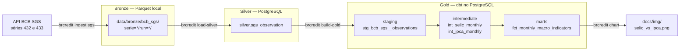

# Arquitetura

Pipeline ELT em camadas (bronze → silver → gold) sobre dados públicos do Banco Central,
executado por uma CLI (`brcredit`). Na Fatia 1, as fontes são a meta Selic (série SGS 432) e o
IPCA (série SGS 433).

## Camadas

| Camada | Onde | Papel | Garantias |
|---|---|---|---|
| Bronze | `data/bronze/` (Parquet) | Cópia fiel do que a API respondeu | Imutável; uma pasta por execução; escrita atômica; manifesto por janela ([ADR-0001](adr/0001-parquet-no-bronze.md)) |
| Silver | schema `silver` (Postgres) | Dado limpo e tipado, uma linha por série e data | Upsert idempotente: só atualiza quando o valor muda; a captura mais recente vence |
| Gold | schemas `gold*` (dbt) | Visão analítica mensal | Testes do dbt: grão único, sem buracos de mês, faixas plausíveis, IPCA 12m igual ao oficial |

## Decisões principais

- **Janelas de 5 anos na API.** O limite da API é de 10 anos para séries diárias, mas perto dele
  ela às vezes estoura o tempo e responde uma página HTML com HTTP 200. Esse caso é tratado como
  erro transitório e gera nova tentativa (até 4).
- **Gold em dbt desde a primeira fatia.** O dbt é o destino do gold; o Airflow entra numa fatia
  posterior e só orquestra a CLI e o dbt.
- **Testes sem rede.** Os testes unitários usam respostas reais da API gravadas em
  `tests/fixtures/`. Os testes de integração usam um banco separado (`brcredit_test`).

## Próximas fatias

Carga incremental com janela de repescagem, CI (GitHub Actions), Airflow, SCR.data (crédito e
inadimplência por UF), IBGE (métricas per capita) e dashboard.
